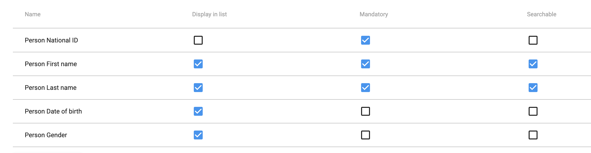

# Using Capture Growth Charts { #capture_growth_charts } 

## About Capture Growth Charts { #about_capture_growth_charts } 

Capture growth charts is a web application that allows users to capture and view growth data for children under the age of 5. The application is designed to be used by health workers in the field to capture growth data for children and to view growth charts for children in their care. The application is designed to be used on a tablet or computer device and is optimized for data entry and visualization of growth charts for efficient monitoring of child development.

# Growth chart plugin upload
Run `yarn build` in the root of the project to build the plugin. The build can then be found in `/build/bundle`, and is a compressed file (`.zip`). <br/>

Upload the compressed file to the DHIS2 instance using the `manuall install` funciton in the **App Management** app. Now the plugin should be an available app on the instance and you can find it on this url: 
- `<Url of instance>/api/apps/capture-growth-chart/plugin.html` 

Make sure to alter `<Url of instance>` with the actual url of you instance.
<br />

# Configuration { #configuration }
## Maintenance app { #maintenance }
The following steps can be made in the **Maintenance** app on DHIS2. <br />

### Data element
Data elements needed to support full functionality in for the growth chart are; **Weight**, **Height** and **Head circumference**. **Weight** can be in either `gram` or `kg`, but **Height** and **Head circumference** should be in `cm`. If one of the data elements are missing, growth charts using that data element will not be displayed. <br /> <br />

### Program
#### Tracked entity attribute
Tracked entity attribues needed for the Growth chart plugin is `Date of birth` and `Gender`. However, `First Name` and `Last Name` are also utilized in additional functionality, but not necessary for using the growth chart itself. <br /> <br />
                    
#### Tracked entity type
Navigate to the tracked entity type for **Person**. This type needs to be assigned the same attributes as those created in the [Tracked Entity Attributes](#tracked-entity-attributes) step. Make sure `Display in list` for the attributes is active, like the image below. 
 <br /> <br />

#### Program     
Select you preffered program for storing the growth variables and displaying the Growth Chart. <br />
##### Attributes
The program should have the following attributes:
- `First name`
- `Last name`
- `Date of birth`
- `Gender`
 <br />

##### Program stages
Select stage where growth variables currently are or will be stored.
The program stage should have the following data elements:
- `Weight` (g or kg)
- `Height` (cm)
- `Head circumference` (cm)
<br /> <br />               
                         
## Datastore Manangement app { #datastore_management }
### Capture
In namespace `capture`, enter the file with key `enrollmentOverviewLayout`
Add new section for the growth chart under `leftColumn`. You can choose where on the left column to place it. Add the following code, but remember to change out `<Url of instance>` with the url of your instance.
```json
{
    "source": "<Url of instance>/api/apps/capture-growth-chart/plugin.html",
    "type": "plugin"
}
```
<br />

### Capture-growth-chart
#### Config      
Create new namespace `capture-growth-chart` with key `config`
The growth chart plugin needs this config to work. Keep in mind that all Id's should be changed, and will be specific for each implementation. 

In the configuration we use a `programStageId` which refers to the program stage where the growth data is stored. 

The `femaleOptionCode` and `maleOptionCode` should map to the option codes that correspont to the gender of the individual. 

Option code used for gender can be found or created in `Option set` under **Other** in the **Maintenance** app. <br />

The `settings` object contains the following keys:
- `customReferences` - A boolean value that determines if custom references should be used.
- `defaultStandard` - A string value that determines the default standard to use. Here you can choose between `z` and `p`, where `z` is the z-score and `p` is the percentile.
- `weightInGrams` - A boolean value that determines if the weight should be in grams or kg. <br />

The structure of the config has to be the same as the one in the example below;
```json
{
    "metadata": {
        "attributes": {
            "dateOfBirth": "AMl8BkN8Lyq",
            "gender": "tyNlJWNnEbs",
            "firstName": "Sx5Gd4JfPrL",
            "lastName": "sljlq9XtqaA",
            "femaleOptionCode": "CGC_Female",
            "maleOptionCode": "CGC_Male"
        },
        "dataElements": {
            "headCircumference": "GfchA70xtmP",
            "height": "wWCSulSdUgd",
            "weight": "yZwKJdYXTZF"
        },
        "program": {
            "programStageId": "h3gT08Et4sC"
        }
    },
    "settings": {
        "customReferences": false,
        "defaultStandard": "ID",
        "weightInGrams": false
    }
}
```    
<br />

#### Custom references (Future functionality)
##### Create custom references
1. Create a new key in the `capture-growth-chart` namespace with the key `customReferences`
2. Add the custom references you want to use. The structure of the custom references has to be the same as the one in the example below. But the **datasetValues** should be changed to fit your own references.
```json
{
    "hcfa_b": {
        "categoryMetadata": {
            "gender": "Boy",
            "label": "Head circumference for age"
        },
        "datasets": {
            "0 to 13 weeks": {
                "datasetValues": [
                    {
                        "SD0": 34.5,
                        "SD1": 35.7,
                        "SD1neg": 33.2,
                        "SD2": 37,
                        "SD2neg": 31.9,
                        "SD3": 38.3,
                        "SD3neg": 30.7
                    },
                    // ... more data points ...
                ],
                "metadata": {
                    "chartLabel": "0 to 13 weeks",
                    "range": {
                        "end": 13,
                        "start": 0
                    },
                    "xAxisLabel": "Weeks",
                    "yAxisLabel": "Head circumference (cm)"
                }
            },
            "0 to 5 years": {
                "datasetValues": [
                    {
                        "SD0": 34.5,
                        "SD1": 35.7,
                        "SD1neg": 33.2,
                        "SD2": 37,
                        "SD2neg": 31.9,
                        "SD3": 38.3,
                        "SD3neg": 30.7
                    },
                    // ... more data points ...
                ],
                "metadata": {
                    "chartLabel": "0 to 5 years",
                    "range": {
                        "end": 5,
                        "start": 0
                    },
                    "xAxisLabel": "Years",
                    "yAxisLabel": "Head circumference (cm)"
                }
            }
        }
    }
}
```
<br />

##### Use custom references

If you want to use custom references, you can set `customReferences` to `true` in the config. This will make the plugin use the custom references you have created. If you want to use the default references, you can set `customReferences` to `false` in the config. This will make the plugin use the WHO references. <br /> 