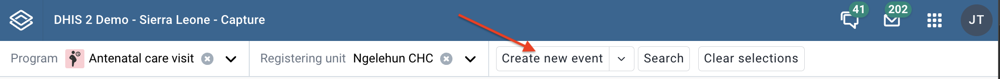

# Using Capture Growth Charts { #capture_growth_charts } 

## About Capture Growth Charts { #about_capture_growth_charts } 

Capture growth charts is a web application that allows users to capture and view growth data for children under the age of 5. The application is designed to be used by health workers in the field to capture growth data for children and to view growth charts for children in their care. The application is designed to be used on a tablet or computer device and is optimized for data entry and visualization of growth charts for efficient monitoring of child development.

## Register an event { #capture_register_event } 

1. Open the **Capture** app.

2. Select an organisation unit.

3. Select an event program.

    You will only see programs associated with the selected organisation unit and programs you have access to, and that are shared with your user group through data level sharing.

4. If the program has a category combination set the category option will have to be selected.

5. Click **Create new event**.

    

6. Fill in the required information. If the programs program stage is configured to capture a location:

    - If the field is a coordinate field you can either enter the coordinates
    directly or you can click the **map** icon to the left of the coordinate field.
    The latter one will open a map where you can search for a location or set on
    directly by clicking on the map.

    - If the field is a polygon field you can click the **map** icon to the left of
    the field. This will open a map where you can search for a location and capture
    a polygon (button in the upper right corner of the map).

7. If desired you can add a comment by clicking the **Write comment** button at the bottom of the form. Note that Event comments are attributed to a user and cannot be deleted. 

8. If desired you can add a relationship by clicking the **Add relationship** button at the bottom of the form.
   See the section about **Adding a relationship** for more information.

9. Click **Save and exit** or click the arrow next to the button to select **Save and add another**.

    - **Save and add another** will save the current event and clear the form.
    All the events that you have captured will be displayed in a list at the bottom of the page.
    When you want to finish capturing events you can, if the form is blank,
    click the finish button or if your form contains data click the arrow
    next to **Save and add another** and select **Save and exit**.

> **Note**
>
> Some data elements in an event might be mandatory (marked with a red star next to the data element label).
> All mandatory data elements must be filled in before the user is allowed to complete the event.
> The exception to this is if the user has the authority called __"Ignore validation of required fields in Tracker and Event Capture".__
> If the user has this authority, the mandatory data elements will not be required and
> the red star will not be displayed next to the data element label. Note that super user that have the __"ALL"__ authority automatically
> have this authority.

> **Tip**
>
> The data entry form can also be displayed in **row view**. In this mode the data elements are arranged horizontally. This can be
> achieved by clicking the **Switch to row view** button on the top right of the data entry form. If you are currently in **row view** you
> can switch to the default form view by clicking the **Switch to form view** button on the top right of the data entry form.

