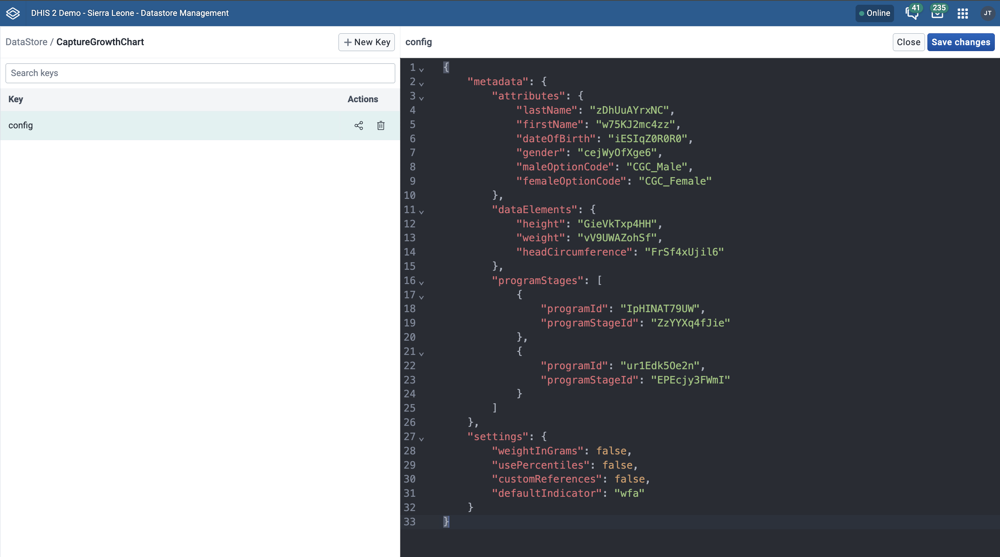
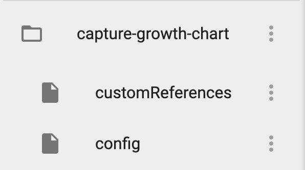

# Using Capture Growth Charts

The Capture Growth Charts plugin is a web application that allows users to capture and view growth data for children under the age of five.
The application is designed to be used by health workers to view growth charts for children in their care.
The plugin is designed to be used on tablet or computer devices and is optimized for data entry and visualization of growth charts for efficient monitoring of child development.

## Plugin Implementation

Plugins allow developers to extend the functionality on DHIS2.
These plugins enable users to customize forms and enrollment dashboards within the Capture app.
The Growth Chart uses the plugin functionality to be implemented in the Capture app.
Read more about plugins [here](https://kdb.devotta.com/docs/capture-plugins/getting-started).

### Prerequisites

- DHIS2 version 2.38 or later
- Access to the [App Management](https://developers.dhis2.org/docs/guides/submit-apphub/#faq) app.
- Access to the [Maintenance](https://docs.dhis2.org/en/use/user-guides/dhis-core-version-240/configuring-the-system/metadata.html) app.
- Access to the [Datastore Management](https://docs.dhis2.org/en/use/user-guides/dhis-core-version-240/maintaining-the-system/datastore-manager.html) app.
- [Capture](https://docs.dhis2.org/en/use/user-guides/dhis-core-version-240/tracking-individual-level-data/capture.html) app version 100.53.0 or later (Can be updated in the **App Management** app).
- [Tracker Plugin Configurator](https://apps.dhis2.org/app/85d156b7-6e3f-43f0-be57-395449393f7d) application (Can be installed in the **App Management** app).

### Growth chart plugin download

Download the Capture Growth Charts plugin available in the [DHIS2 App Hub](https://apps.dhis2.org/app/09f48f78-b67c-4efa-90ad-9ac2fed53bb8) in the **App Management** app on DHIS2.


## Configuration

The following steps are needed to configure the Growth Chart plugin in the Capture app.

### Maintenance app

The following steps can be made in the **Maintenance** app on DHIS2.
The steps can be skipped if the necessary metadata is already in place.


#### Tracked entity attributes

Tracked entity attributes needed for the Growth chart plugin are `Date of birth` and `Gender`.

> **Tip:** `First name` and `Last name` are also utilized in additional functionality, but not necessary for using the growth chart itself.

##### Assign attributes to Program

Select or create the preferred program for storing the growth variables and displaying the Growth Chart plugin.
Documentation for configuring programs on DHIS2 can be found [here](https://docs.dhis2.org/en/use/user-guides/dhis-core-version-241/configuring-the-system/programs.html).

The program should have the following attributes:

- `First name`
- `Last name`
- `Date of birth`
- `Gender`


#### Data elements
[Data elements](https://docs.dhis2.org/en/use/user-guides/dhis-core-version-master/configuring-the-system/metadata.html#manage_data_element) needed to support full functionality for the growth chart are: **Weight**, **Height** and **Head circumference**.
**Weight** can be in either `grams` or `kg`, but **Height** and **Head circumference** should be in `cm`.
If any of the data elements are missing, the growth chart will not be displayed.
Documentation for configuring data elements on DHIS2 can be found [here](https://docs.dhis2.org/en/use/user-guides/dhis-core-version-master/configuring-the-system/metadata.html#manage_data_element).

##### Assign data elements to Program stage

Select the stage where growth data should be collected.
The program stage should have the following data elements:

- `Weight` (g or kg)
- `Height` (cm)
- `Head circumference` (cm)


### Datastore Management app

The following steps can be made in the **Datastore Management** app on DHIS2.
Documentation for the application can be found [here](https://docs.dhis2.org/en/use/user-guides/dhis-core-version-240/maintaining-the-system/datastore-manager.html).

#### Create captureGrowthChart namespace and config key

Create a new namespace with the name `captureGrowthChart`.
Create a new key `config` in the `captureGrowthChart` namespace, as seen in the image below.
Refer to the [documentation](https://docs.dhis2.org/en/use/user-guides/dhis-core-version-240/maintaining-the-system/datastore-manager.html) for guidance on creating a new namespace and key.



The growth chart plugin depends on this config to work properly. Replace the placeholders with the actual IDs of the attributes, data elements, program, and program stages.

The structure of the config has to be the same as the one in the example below.

```json
{
  "metadata": {
    "attributes": {
      "dateOfBirth": "replace_with_date_of_birth_attribute_id",
      "gender": "replace_with_gender_attribute_id",
      "firstName": "replace_with_first_name_attribute_id",
      "lastName": "replace_with_last_name_attribute_id",
      "femaleOptionCode": "replace_with_female_option_code",
      "maleOptionCode": "replace_with_male_option_code"
    },
    "dataElements": {
      "headCircumference": "replace_with_head_circumference_data_element_id",
      "height": "replace_with_height_data_element_id",
      "weight": "replace_with_weight_data_element_id"
    },
    "programStageForGrowthChart": {
      "replace_with_programId_1": "replace_with_program_stage_id_1",
      "replace_with_programId_2": "replace_with_program_stage_id_2",
      "replace_with_programId_3": "replace_with_program_stage_id_3"
    }
  },
  "settings": {
    "usePercentiles": false,
    "customReferences": false,
    "weightInGrams": false,
    "defaultIndicator": "replace_with_default_indicator"
  }
}
``` 

##### Config structure explanation

The `metadata` object contains the following keys:

- `attributes` - Contains the attribute IDs for **dateOfBirth**, **gender**, **firstName**, **lastName**, **femaleOptionCode** and **maleOptionCode**.
  All of these attribute IDs can be set in the **Maintenance** app under `Tracked entity attributes`, except for the **femaleOptionCode** and **maleOptionCode** which can be set in `Option set` under **Other** in the **Maintenance** app.
  Documentation for `Option Sets` can be found [here](https://docs.dhis2.org/en/use/user-guides/dhis-core-version-240/configuring-the-system/metadata.html#manage_option_set).
- `dataElements` - Contains the data element IDs for **headCircumference**, **height** and **weight**.
  All of these data element IDs can be found in the **Maintenance** app under **Data elements**.
- `programStageForGrowthChart` - Object mapping program IDs to their corresponding program stage IDs used for growth chart data:
  - Key: `programId` - The ID of the program
  - Value: `programStageId` - The ID of the program stage where growth data is collected.
  These IDs can be found in the **Maintenance** app under **Programs** and **Program stages**.
  **Note**: Each program can only have one program stage configured for growth chart data collection.


The `settings` object contains the following keys:

- `usePercentiles` - A boolean value that determines if the growth chart should use percentiles or z-scores.
  If `true`, the growth chart will use percentiles.
  If `false`, the growth chart will use z-scores.
- `customReferences` - A boolean value that determines if the growth chart should use custom references or WHO references.
  If `true`, the growth chart will use custom references.
  If `false`, the growth chart will use WHO references.
- `weightInGrams` - A boolean value that determines if the weight should be in grams or kilograms.
  If `true`, the weight will be in grams.
  If `false`, the weight will be in kilograms.
- `defaultIndicator` - A string value that determines which indicator should be displayed by default.
  If it isn't set, the default indicator will be weight for age.
  The indicator key should be one of the following:
    - `"hcfa"` -> Head circumference for age
    - `"lhfa"` -> Length/height for age
    - `"wfa"` -> Weight for age
    - `"wflh"` -> Weight for length/height


## Enable the plugin

The **Tracker Plugin Configurator** app is used to enable the Growth Chart plugin in the Capture app.
To display the growth chart in the Capture app, it is highly recommended to use the **Tracker Plugin Configurator** app. See documentation for [configuring enrollment plugins here](https://developers.dhis2.org/docs/capture-plugins/developer/configure-a-capture-plugin).

If you do not use the **Tracker Plugin Configurator** app, you can follow the guide on [configuring enrollment plugins](https://kdb.devotta.com/docs/capture-plugins/enrollment-plugins). Then the source should be:
`"source": "https://<instance-url>/api/apps/capture-growth-chart/plugin.html"`


You are now finished with the configuration and ready to use the Growth Chart plugin in the Capture app with WHO's standard references.

> If you want to use country-specific references, follow the steps in the next section.


## Custom references

The growth chart plugin can be configured to use country-specific references, instead of the WHO's standard references.
This can be useful if you want to use references that are specific to your country or region.
The custom references can be set up in the **Datastore Management** app.

### Datastore Management app

The following steps can be made in the **Datastore Management** app on DHIS2.
Documentation for the application can be found [here](https://docs.dhis2.org/en/use/user-guides/dhis-core-version-240/maintaining-the-system/datastore-manager.html).


#### Create custom references

1. Create a new key in the `captureGrowthChart` namespace with the key `customReferences`, as seen in the image below.

   

2. Add configuration to `customReferences`. The structure of the custom references configuration has to be the same format as in the example below, but the contents of **percentileDatasetValues** and **zScoreDatasetValues** should be changed to your custom references.
   However, you don't need to add references for both percentiles and z-scores.

```json
{
  "<Indicator key>": {
    "categoryMetadata": {
      "gender": "<Girl || Boy>",
      "label": "<Indicator label>"
    },
    "datasets": {
      "<time interval>": {
        "metadata": {
          "range": {
            "end": <X-axis_dataset_end>,
            "start": <X-axis_dataset_start>
          },
          "xAxisLabel": "<Weeks || Months || Weight>",
          "yAxisLabel": "<Anthropometric measurements, Height || Length || Weight || Head circumference>"
        },
        "percentileDatasetValues": [
          {
            "P3": <P3_value>,
            "P15": <P15_value>,
            "P50": <P50_value>,
            "P85": <P85_value>,
            "P97": <P97_value>
          }
        ],
        "zScoreDatasetValues": [
          {
            "SD0": <SD0_value>,
            "SD1": <SD1_value>,
            "SD2": <SD2_value>,
            "SD3": <SD3_value>,
            "SD1neg": <SD1neg_value>,
            "SD2neg": <SD2neg_value>,
            "SD3neg": <SD3neg_value>
          }
        ]
      }
    }
  }
}
```

3. Add other indicators if you want, but make sure that the key maps to the right category and gender.
   The indicator key should be one of the following:

   - `"hcfa_g"` -> Head circumference for age
   - `"lhfa_g"` -> Length/height for age
   - `"wfa_g"` -> Weight for age
   - `"wlfh_g"` -> Weight for length/height

`"_g"` indicates that the gender is girl.
If you want to add references for boys, you can add the same key but with `"_b"` instead of `"_g"`.
For example:
`"hcfa_b"` -> Head circumference for age, boys.

Here is an example of how the custom references could look like:

```json
{
  "lhfa_g": {
    "categoryMetadata": {
      "gender": "Girl",
      "label": "Length/height for age"
    },
    "datasets": {
      "0 to 13 weeks": {
        "metadata": {
          "chartLabel": "0 to 13 weeks",
          "range": {
            "end": 13,
            "start": 0
          },
          "xAxisLabel": "Weeks",
          "yAxisLabel": "Length"
        },
        "percentileDatasetValues": [
          {
            "P15": 47.2,
            "P3": 45.6,
            "P50": 49.1,
            "P85": 51.1,
            "P97": 52.7
          }
          // Add more data here
        ],
        "zScoreDatasetValues": [
          {
            "SD0": 49.1,
            "SD1": 51,
            "SD1neg": 47.3,
            "SD2": 52.9,
            "SD2neg": 45.4,
            "SD3": 54.7,
            "SD3neg": 43.6
          }
          // Add more data here
        ]
      },
      "0 to 2 years": {
        "metadata": {
          "range": {
            "end": 24,
            "start": 0
          },
          "xAxisLabel": "Months",
          "yAxisLabel": "Length"
        },
        "percentileDatasetValues": [
          {
            "P15": 47.2,
            "P3": 45.6,
            "P50": 49.1,
            "P85": 51.1,
            "P97": 52.7
          }
          // Add more data here
        ],
        "zScoreDatasetValues": [
          {
            "SD0": 49.1,
            "SD1": 51,
            "SD1neg": 47.3,
            "SD2": 52.9,
            "SD2neg": 45.4,
            "SD3": 54.7,
            "SD3neg": 43.6
          }
          // Add more data here
        ]
      },
      "2 to 5 years": {
        "metadata": {
          "chartLabel": "2 to 5 years",
          "range": {
            "end": 60,
            "start": 24
          },
          "xAxisLabel": "Months",
          "yAxisLabel": "Height"
        },
        "percentileDatasetValues": [
          {
            "P15": 82.4,
            "P3": 79.6,
            "P50": 85.7,
            "P85": 89.1,
            "P97": 91.8
          }
          // Add more data here
        ],
        "zScoreDatasetValues": [
          {
            "SD0": 85.7,
            "SD1": 88.9,
            "SD1neg": 82.5,
            "SD2": 92.2,
            "SD2neg": 79.3,
            "SD3": 95.4,
            "SD3neg": 76
          }
          // Add more data here
        ]
      }
    }
  }
}
```

###### Use custom references

Now you can set `customReferences` to `true` in the key `config` in the `captureGrowthChart` namespace.
This will make the plugin use the custom references you have created.
If you want to use the default references, you can set `customReferences` back to `false`.
This will make the plugin use the WHO references.
Make sure to also alter the `usePercentiles` setting in the chart config to match the references you are using (z-scores or percentiles). 
