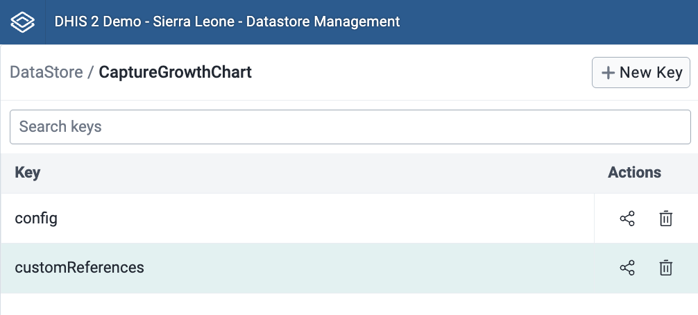

# Using Capture Growth Charts

## About Capture Growth Charts

Capture growth charts plugin is a web application that allows users to capture and view growth data for children under
the age of 5.
The application is designed to be used by health workers to capture growth data for children and to view growth charts
for children in their care.
The plugin is designed to be used on a tablet or computer device and is optimized for data entry and visualization of
growth charts for efficient monitoring of child development.

# Plugin Implementation

Plugins allows developers to extend the functionality on DHIS2.
These plugins enable users to customize form fields and sections within the Capture app, potentially enhancing data
entry and user experience.
The Growth Chart is using the plugin functionality to be implemented in the Capture app.
Read more about plugins [here](https://kdb.devotta.com/docs/capture-plugins/getting-started).

## Prerequisites

- DHIS2 version 2.38 or later
- [Capture](https://docs.dhis2.org/en/use/user-guides/dhis-core-version-240/tracking-individual-level-data/capture.html)
  app version v100.53.0 or later (Can be updated in the **App Management** app).
- Access to
  the [Maintenance](https://docs.dhis2.org/en/use/user-guides/dhis-core-version-240/configuring-the-system/metadata.html)
  app.
- Access to
  the [Datastore Management](https://docs.dhis2.org/en/use/user-guides/dhis-core-version-240/maintaining-the-system/datastore-manager.html)
  app.
- Access to the [App Management](https://developers.dhis2.org/docs/guides/submit-apphub/#faq) app.
- [Tracker Plugin Configurator](https://apps.dhis2.org/app/85d156b7-6e3f-43f0-be57-395449393f7d) application (Can be
  installed in the **App Management** app).

# Growth chart plugin download

Download the Capture Growth Charts plugin availiable in
the [DHIS2 App Hub](https://apps.dhis2.org/app/09f48f78-b67c-4efa-90ad-9ac2fed53bb8) in the **App Management**
application on DHIS2.

# Configuration

The following steps are needed to configure the Growth Chart plugin in the Capture app.

## Maintenance app

The following steps can be made in the **Maintenance** app on DHIS2.
The steps can be skipped if the necessary metadata is already in place.

### Data element

[Data elements](https://docs.dhis2.org/en/use/user-guides/dhis-core-version-master/configuring-the-system/metadata.html#manage_data_element)
needed to support full functionality in for the growth chart are; **Weight**, **Height** and **Head circumference**.
**Weight** can be in either `gram` or `kg`, but **Height** and **Head circumference** should be in `cm`.
If one of the data elements are missing, growth charts using that data element will not be displayed.
Documentation for configuring data elements on DHIS2 can be
found [here](https://docs.dhis2.org/en/use/user-guides/dhis-core-version-master/configuring-the-system/metadata.html#manage_data_element).

### Program

Create a program for storing the growth variables and displaying the Growth Chart.
Documentation for configuring programs on DHIS2 can be
found [here](https://docs.dhis2.org/en/use/user-guides/dhis-core-version-241/configuring-the-system/programs.html).

#### Tracked entity attributes

Tracked entity attribues needed for the Growth chart plugin are `Date of birth` and `Gender`.

> **Tip:** `First Name` and `Last Name` are also utilized in additional functionality, but not necessary for using the
> growth chart itself.

#### Tracked entity type

Navigate to the tracked entity type for **Person**.
This type needs to be assigned the same attributes as those created in the previous
step (`Date of birth`, `Gender`, `First Name` and `Last Name`).

> **Note:** Make sure `Display in list` for the attributes is active, like the image below.


#### Program

Select or create the preffered program for storing the growth variables and displaying the Growth Chart plugin.

##### Attributes

The program should have the following attributes:

- `First name`
- `Last name`
- `Date of birth`
- `Gender`

##### Program stages

Select stage where growth variables currently are or will be stored.
The program stage should have the following data elements:

- `Weight` (g or kg)
- `Height` (cm)
- `Head circumference` (cm)

## Datastore Manangement app

The following steps can be made in the **Datastore Management** app on DHIS2.
Documentation for the application can be
found [here](https://docs.dhis2.org/en/use/user-guides/dhis-core-version-240/maintaining-the-system/datastore-manager.html).

### Capture-growth-chart namespace

#### Config

Create a new namespace `capture-growth-chart` with key `config`, as seen in the image below.


The growth chart plugin depends on this config to work properly.
Keep in mind that all ID's should be changed, and will be specific for each implementation.

The structure of the config has to be the same as the one in the example below;

```json
{
  "metadata": {
    "attributes": {
      "dateOfBirth": "AMl8BkN8Lyq",
      "gender": "tyNlJWNnEbs",
      "firstName": "Sx5Gd4JfPrL",
      "lastName": "sljlq9XtqaA",
      "femaleOptionCode": "CGC_Female",
      "maleOptionCode": "CGC_Male"
    },
    "dataElements": {
      "headCircumference": "GfchA70xtmP",
      "height": "wWCSulSdUgd",
      "weight": "yZwKJdYXTZF"
    },
    "program": {
      "programStageId": "h3gT08Et4sC"
    }
  },
  "settings": {
    "usePercentiles": false,
    "customReferences": false,
    "weightInGrams": false,
    "defaultIndicator": "wfa"
  }
}
``` 

##### Metadata

The `metadata` object contains the following keys:

- `attributes` - Contains the attribute IDs for **dateOfBirth**, **gender**, **firstName**, **lastName**, *
  *femaleOptionCode** and **maleOptionCode**.
  All of these attribute IDs can be found in the **Maintenance** app under `Tracked entity attributes`, except for the *
  *femaleOptionCode** and **maleOptionCode** which can be found in `Option set` under **Other** in the **Maintenance**
  app.
  Documentation for `Option Sets` can be
  found [here](https://docs.dhis2.org/en/use/user-guides/dhis-core-version-240/configuring-the-system/metadata.html#manage_option_set).
- `dataElements` - Contains the data element IDs for **headCircumference**, **height** and **weight**.
  All of these data element IDs can be found in the **Maintenance** app under **Data elements**.
- `program` - Contains the program stage ID for the program stage where the growth data is stored.
  This ID can be found in the **Maintenance** app under **Programs** and **Program stages**.

##### Settings

The `settings` object contains the following keys:

- `usePercentiles` - A boolean value that determines if the growth chart should use percentiles or z-scores.
  If `true`, the growth chart will use percentiles.
  If `false`, the growth chart will use z-scores
- `customReferences` - A boolean value that determines if the growth chart should use custom references or the WHO
  references.
  If `true`, the growth chart will use custom references.
  If `false`, the growth chart will use the WHO references.
- `weightInGrams` - A boolean value that determines if the weight should be in grams or kg.
  If `true`, the weight will be in grams.
  If `false`, the weight will be in kg.
- `defaultIndicator` - A string value that determines which indicator should be displayed by default.
  If it isnt set, the default indicator will be weight for age.
  The indicator key should be one of the following:
    - `"hcfa"` -> Head circumference for age
    - `"lhfa"` -> Length/height for age
    - `"wfa"` -> Weight for age
    - `"wflh"` -> Weight for length/height

# Enable the plugin in the Capture enrollment dashboard

## Tracker Plugin Configurator app

The **Tracker Plugin Configurator** app is used to enable the Growth Chart plugin in the Capture app.
To display the growth chart in the Capture app, use the **Tracker Plugin Configurator** app or follow the guide
on [configuring enrollment plugins](https://kdb.devotta.com/docs/capture-plugins/enrollment-plugins).

> **Note:** You are now finished with the configuration and ready to use the Growth Chart plugin in the Capture app with
> WHO's standard references.
> If you want to use country specific references, follow the steps in the next section.

# Custom references

The growth chart plugin can be configured to use country specific references, instead of the WHO's standard references.
This can be useful if you want to use references that are specific to your country or region.
The custom references can be set up in the **Datastore Management** app.
If you don't want to use custom references, you are finished with the configuration.

## Datastore Management app

### Create custom references

1. Create a new key in the `capture-growth-chart` namespace with the key `customReferences`, as seen in the image below.



2. Here is the format for `customReferences`:

```json
{
  "<Indicator key>": {
    "categoryMetadata": {
      "gender": "<Girl || Boy>",
      "label": "<Indicator label>"
    },
    "datasets": {
      "<time interval>": {
        "metadata": {
          "range": {
            "end": <X-axis
            dataset
            end>,
            "start": <X-axis
            dataset
            start>
          },
          "xAxisLabel": "<Weeks || Months || Weight>",
          "yAxisLabel": "<Anthropometric measurements, Height || Length || Weight || Head circumference>"
        },
        "percentileDatasetValues": [
          {
            "P3": <P3
            value>,
            "P15": <P15
            value>,
            "P50": <P50
            value>,
            "P85": <P85
            value>,
            "P97": <P97
            value>
          }
        ],
        "zScoreDatasetValues": [
          {
            "SD0": <SD0
            value>,
            "SD1": <SD1
            value>,
            "SD2": <SD2
            value>,
            "SD3": <SD3
            value>,
            "SD1neg": <SD1neg
            value>,
            "SD2neg": <SD2neg
            value>,
            "SD3neg": <SD3neg
            value>
          }
        ]
      }
    }
  }
}
```

3. Add the custom references you want to use. The structure of the custom references has to be the same as the one in
   the example above. But the contents of **percentileDatasetValues** and **zScoreDatasetValues** should be changed to
   your custom references. However, you don't need to add references for both percentiles and z-scores, you can choose
   to only add one of them if desired.
4. Add other indicators if you want, but make sure that the key maps to the right category and gender. The indicator key
   should be one of the following:

- `"hcfa_g"` -> Head circumference for age
- `"lhfa_g"` -> Length/height for age
- `"wfa_g"` -> Weight for age
- `"wlfh_g"` -> Weight for length/height
  <br>
  `"_g"` indicates that the gender is girl. If you want to add references for boys, you can add the same key but
  with `"_b"` instead of `"_g"`.
  For example;
  `"hcfa_b"` -> Head circumference for age, boys.

Here is an example of how the custom references could look like:

```json
{
  "lhfa_g": {
    "categoryMetadata": {
      "gender": "Girl",
      "label": "Length/height for age"
    },
    "datasets": {
      "0 to 13 weeks": {
        "metadata": {
          "chartLabel": "0 to 13 weeks",
          "range": {
            "end": 13,
            "start": 0
          },
          "xAxisLabel": "Weeks",
          "yAxisLabel": "Length"
        },
        "percentileDatasetValues": [
          {
            "P15": 47.2,
            "P3": 45.6,
            "P50": 49.1,
            "P85": 51.1,
            "P97": 52.7
          }
          // Add more data here
        ],
        "zScoreDatasetValues": [
          {
            "SD0": 49.1,
            "SD1": 51,
            "SD1neg": 47.3,
            "SD2": 52.9,
            "SD2neg": 45.4,
            "SD3": 54.7,
            "SD3neg": 43.6
          }
          // Add more data here
        ]
      },
      "0 to 2 years": {
        "metadata": {
          "range": {
            "end": 24,
            "start": 0
          },
          "xAxisLabel": "Months",
          "yAxisLabel": "Length"
        },
        "percentileDatasetValues": [
          {
            "P15": 47.2,
            "P3": 45.6,
            "P50": 49.1,
            "P85": 51.1,
            "P97": 52.7
          }
          // Add more data here
        ],
        "zScoreDatasetValues": [
          {
            "SD0": 49.1,
            "SD1": 51,
            "SD1neg": 47.3,
            "SD2": 52.9,
            "SD2neg": 45.4,
            "SD3": 54.7,
            "SD3neg": 43.6
          }
          // Add more data here
        ]
      },
      "2 to 5 years": {
        "metadata": {
          "chartLabel": "2 to 5 years",
          "range": {
            "end": 60,
            "start": 24
          },
          "xAxisLabel": "Months",
          "yAxisLabel": "Height"
        },
        "percentileDatasetValues": [
          {
            "P15": 82.4,
            "P3": 79.6,
            "P50": 85.7,
            "P85": 89.1,
            "P97": 91.8
          }
          // Add more data here
        ],
        "zScoreDatasetValues": [
          {
            "SD0": 85.7,
            "SD1": 88.9,
            "SD1neg": 82.5,
            "SD2": 92.2,
            "SD2neg": 79.3,
            "SD3": 95.4,
            "SD3neg": 76
          }
          // Add more data here
        ]
      }
    }
  }
}
```

##### Use custom references

Now you can set `customReferences` to `true` in the config. This will make the plugin use the custom references you have
created. If you want to use the default references, you can set `customReferences` to `false` in the config. This will
make the plugin use the WHO references. Make sure to also alter the `usePercentiles` in the chart config to match the
references you are using, z-scores or percentiles. 
